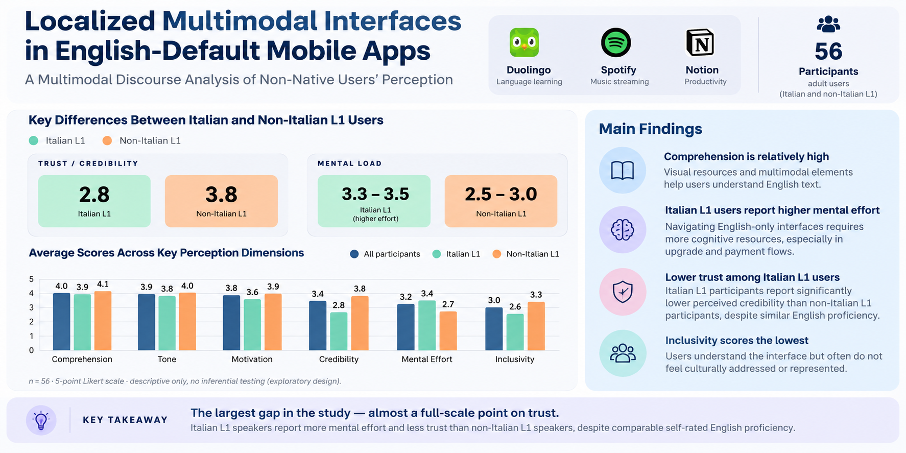

# Localized Multimodal Interfaces in English-Default Mobile Apps

## Overview

This research explores how English-only mobile interfaces influence comprehension, trust, cognitive load, and inclusivity for non-native users.

The study examined onboarding and upgrade experiences in Duolingo, Spotify, and Notion through multimodal analysis and a user perception survey involving 56 participants.

## Key Finding

Italian L1 participants reported higher mental effort and lower trust than non-Italian L1 participants, despite comparable self-rated English proficiency.

## Research Focus

- Multilingual UX
- Localization
- User Trust
- Mobile App Interfaces
- User Perception

## Author

Hanieh Hatefi

UX Researcher specializing in multilingual UX, localization, user trust, and user behavior.

## Connect

- Portfolio Website: [http://haniehhatefi.it/]
- LinkedIn: [https://www.linkedin.com/in/hanieh-hatefi/]
- ResearchGate: [ttps://www.researchgate.net/profile/Hanieh-Hatefi]
- ORCID: [https://orcid.org/0009-0004-5357-1381]
